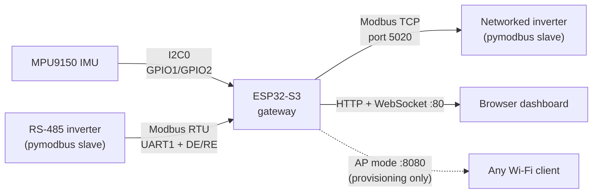
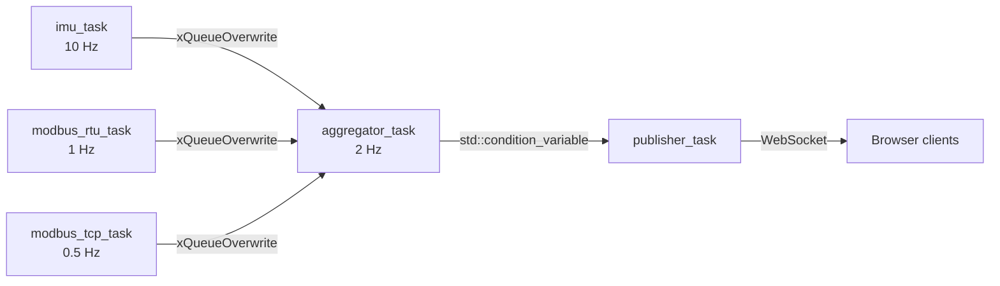
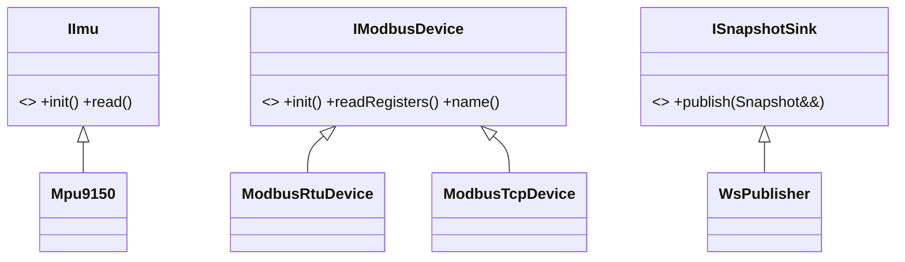

# Architecture

System design for `energy-device-gateway`. Derived from VISION.md §6 and the
per-component `DESIGN.md` files, updated with what hardware testing actually
showed.

---

## 1. System context



The gateway is a **Modbus master** on both transports — it polls, nothing pushes
to it. On the north side it is an HTTP/WebSocket **server**.

---

## 2. Task model

| Task | Priority | Core | Period | Stack | Role |
|---|---:|---|---|---:|---|
| `imu_task` | 5 | any | 100 ms | 4096 | Reads IMU over I2C into 7 mailboxes |
| `modbus_rtu_task` | 4 | 1 | 1000 ms | 4096 | Polls RTU registers into 5 mailboxes |
| `modbus_tcp_task` | 4 | 1 | 2000 ms | 4096 | Polls TCP registers into 5 mailboxes |
| `aggregator_task` | 3 | 1 | 500 ms | 4096 | Snapshots every mailbox, signals publisher |
| `publisher_task` | 2 | 1 | on signal | 6144 | Serialises the snapshot, broadcasts to clients |
| `health_task` | 1 | any | 5000 ms | 4096 | Logs heap and stack high-water marks |

Wi-Fi is handled by ESP-IDF's own event loop plus callbacks in `WifiManager`, not
a task this project creates — VISION.md §6.1 lists a `WifiManagerTask` that does
not exist as such.

Everything on the sensor→publisher path is pinned to **core 1**, keeping it off
core 0 where the Wi-Fi driver runs. `imu_task` and `health_task` are unpinned:
the first predates the decision and has ample headroom, the second is explicitly
`tskNO_AFFINITY` so monitoring runs only in slack time.

Measured stack headroom is in [docs/ram_budget.md](docs/ram_budget.md); the
tightest is 42%.

---

## 3. Data flow



**17 mailboxes, one per reading** — not one per source. Each is a
`xQueueCreate(1, sizeof(Reading))` used with `xQueueOverwrite`, so a producer
never blocks and a slow consumer never sees a backlog, only the newest value.

The obvious alternative — one mailbox per device carrying a
`std::vector<Reading>` — is a memory-safety trap: `xQueueOverwrite` `memcpy`s the
vector *header*, then the producer's vector destructor frees the buffer the
consumer is now pointing at. The per-`Reading` fan-out exists specifically to
avoid that, and `Reading` is a POD precisely so it can travel through a queue.

### Timing

A reading's worst-case age when it reaches the browser is its poll period plus
the aggregator's 500 ms, plus delivery. Measured snapshot-to-browser latency:
median 55 ms, p95 275 ms, max 413 ms — against **REQ-NF-004's 500 ms**. Board-side
snapshot cadence is exactly 500.000 ms with zero drift.

---

## 4. Concurrency split

Two different primitives are used deliberately:

| Path | Primitive | Why |
|---|---|---|
| sensors → aggregator | FreeRTOS `xQueueOverwrite` | Mailbox semantics (keep newest, never block), scheduler-integrated blocking with timeout |
| aggregator → publisher | `std::mutex` + `std::condition_variable` | Hand-off of one large object; C++ ownership and RAII locking |

The sensor side needs *lossy, latest-value* semantics that a queue gives
directly. The publisher side needs to move a whole `Snapshot` under a lock and
wake exactly one waiter, which is what a condition variable expresses.

---

## 5. Component map

```
components/
├── common/           Reading, Snapshot, ISnapshotSink  (shared types only)
├── imu/              IImu <- Mpu9150,  imuTask
├── modbus_device/    IModbusDevice <- ModbusRtuDevice, ModbusTcpDevice
├── aggregator/       Aggregator  (+ host_test/, runs on the linux target)
├── publisher/        WsPublisher : ISnapshotSink
├── wifi_manager/     WifiManager  (STA, AP fallback, NVS, provisioning server)
└── health/           HealthMonitor  (/health endpoint + monitor task)
main/                 app_main only — construction and wiring, no logic
```

Dependency direction is strictly one-way: `main` knows every component,
components know only `common`. `Aggregator` depends on `ISnapshotSink` rather
than `WsPublisher` directly — `WsPublisher` pulls in `esp_http_server`, which has
no linux-target port, and that indirection is what makes the aggregator
host-testable.

### Class hierarchy



Both Modbus transports satisfy one interface and share `ModbusScaling.hpp` for
register arithmetic, so the TCP device carries no dependency on the RTU one.

---

## 6. Status semantics

Every reading carries `Status { OK, TIMEOUT, ERROR }`, and precedence is decided
in the aggregator:

1. **Mailbox empty** → `TIMEOUT` — nothing has ever arrived from this source.
2. **Stale** (older than the source's configured timeout) → `TIMEOUT`.
3. **Otherwise** → whatever the producer set, including `ERROR`.

The aggregator may only *lower* a status, never raise one. This matters: a
failing Modbus device republishes `allFailed()` with a **fresh** timestamp on
every poll, so it never looks stale — an earlier version overwrote the producer's
`ERROR` with `OK`, making a dead inverter indistinguishable from one reading 0 V.

Stale timeouts are roughly 3× the poll period, so one missed poll does not flap
the status:

| Source | Poll | Stale timeout |
|---|---|---|
| `imu.*` | 100 ms | 500 ms |
| `modbus_rtu.*` | 1000 ms | 3000 ms |
| `modbus_tcp.*` | 2000 ms | 5000 ms |

---

## 7. Resource ownership

RAII throughout, per REQ-NF-006 — every acquisition is a constructor and every
release a destructor:

| Resource | Owner |
|---|---|
| I2C device handle | `Mpu9150` |
| UART port + RS-485 mode | `ModbusRtuDevice` |
| TCP socket | `ModbusTcpDevice` (reopened lazily on failure) |
| HTTP server | `WsPublisher` |
| Wi-Fi init, event handlers, timer | `WifiManager` |

`HealthMonitor` is the deliberate exception: it registers a URI on the
publisher's server but does not own it, so it releases nothing.

Components are held as `std::unique_ptr` in `app_main`; there is no raw
`new`/`delete` anywhere.

---

## 8. Failure behaviour

No single source can take the gateway down (**REQ-NF-001**):

- **Any** source that fails to initialise is logged, not fatal — its readings
  report `ERROR` or `TIMEOUT` and every other source keeps streaming. The IMU
  was originally the exception: `ESP_ERROR_CHECK(g_imu->init())` aborted, so a
  single nudged I2C jumper reboot-looped the entire gateway, taking both Modbus
  transports, the aggregator and the dashboard with it. That contradicted
  REQ-NF-001 and is fixed.
- `modbus_tcp_task` waits on the Wi-Fi event group before opening a socket, and
  publishes `TIMEOUT` while the link is down rather than letting the dashboard
  freeze on stale values.
- The TCP socket reconnects lazily inside `readRegisters()`, so a slave that
  disappears and returns recovers without restarting the task or the board —
  verified by killing and restarting the simulator.
- A publisher that fails to start leaves sensors running; only the dashboard is
  lost.

Fatal (`ESP_ERROR_CHECK`) is now reserved for creating the I2C *bus* and for
Wi-Fi init — allocating a bus controller failing means the SoC peripheral is
unusable. A *device* on that bus not answering is a runtime condition and
degrades gracefully.

---

## 9. Image size

879,465 bytes total; 16% of the app partition free. Project code is ~21.5 KB of
that — about 2.4% — the remainder being ESP-IDF, chiefly Wi-Fi, lwIP and mbedTLS.
Full breakdown in [docs/ram_budget.md](docs/ram_budget.md).
