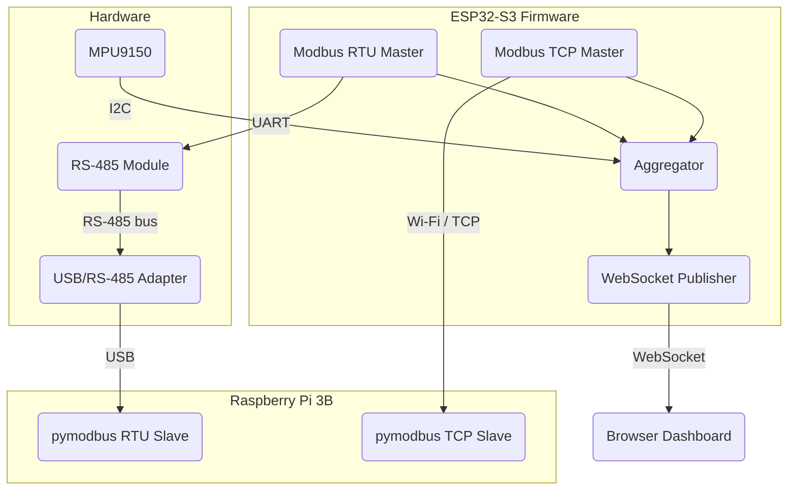
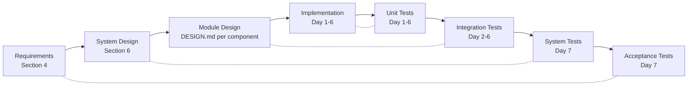
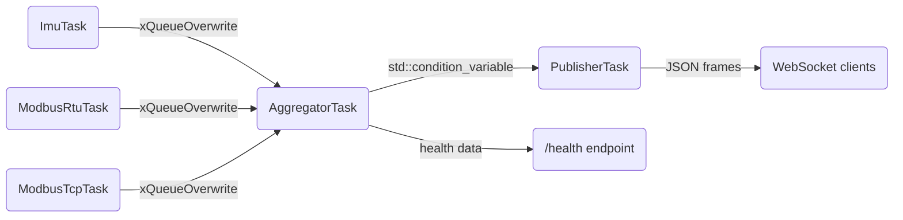
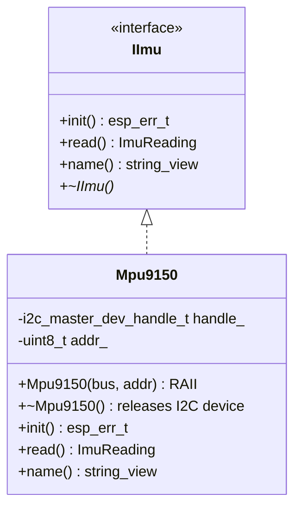
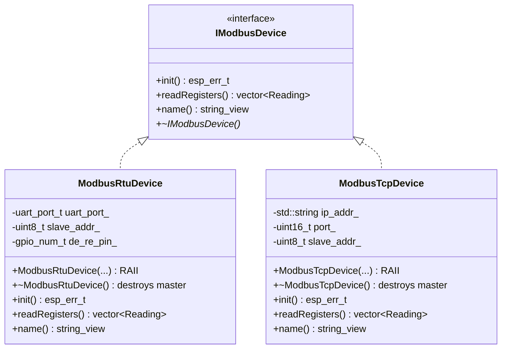

# Energy Device Gateway — Vision Document

**Project:** `energy-device-gateway`
**Author:** Luca Agrippino
**Date:** July 2026
**Status:** Draft

---

## 1. Purpose

This project is a portfolio-grade embedded firmware for an ESP32-S3 that acts as a gateway between local sensors/devices and a browser-based dashboard. It demonstrates production embedded practices in a context directly relevant to energy management systems: reading IMU data over I2C, communicating with industrial devices over Modbus RTU (RS-485) and Modbus TCP, aggregating telemetry, and streaming it in real time over WebSocket.

The firmware is developed using ESP-IDF v5.5 in C++, follows the V-model development process, runs on Linux, and includes CI via GitHub Actions.

---

## 2. Development Environment

### 2.1 Host Machine

| Item              | Details                                    |
|-------------------|--------------------------------------------|
| Host OS           | Windows 10/11                              |
| Development OS    | Linux (Ubuntu 24.04 via WSL2)              |
| IDE               | VS Code (Windows) + Remote-WSL extension + ESP-IDF extension |
| USB passthrough   | `usbipd-win` (Windows → WSL2)             |
| Version control   | Git with conventional commits              |

Windows is used only as the host for WSL2 and for USB device management (`usbipd-win`). All development — building, flashing, debugging, testing — happens natively inside WSL2 Ubuntu. This mirrors Powerverse's Linux-based workflow.

### 2.2 WSL2 Ubuntu Setup

All development tools are installed directly inside the WSL2 Ubuntu 24.04 distribution. No Docker container is used for local development (CI still uses the `espressif/idf:v5.5` Docker image in GitHub Actions).

**Step 1 — Install WSL2 with Ubuntu 24.04 (PowerShell as Administrator):**

```powershell
wsl --install -d Ubuntu-24.04
```

After reboot, launch Ubuntu from the Start menu and create your Linux user.

**Step 2 — Install system dependencies (inside WSL2 Ubuntu):**

```bash
sudo apt update && sudo apt upgrade -y
sudo apt install -y \
    git wget curl flex bison gperf \
    python3 python3-pip python3-venv \
    cmake ninja-build \
    ccache \
    libffi-dev libssl-dev \
    dfu-util libusb-1.0-0 \
    clang-tidy clang-format \
    picocom \
    udev
```

**Step 3 — Install ESP-IDF v5.5:**

```bash
mkdir -p ~/esp
cd ~/esp
git clone -b v5.5 --recursive https://github.com/espressif/esp-idf.git
cd esp-idf
./install.sh esp32s3
```

**Step 4 — Auto-source ESP-IDF on shell start:**

Add to `~/.bashrc`:

```bash
echo 'alias get_idf=". $HOME/esp/esp-idf/export.sh"' >> ~/.bashrc
source ~/.bashrc
```

Run `get_idf` at the start of each terminal session (or source it automatically if preferred).

**Step 5 — Verify installation:**

```bash
get_idf
idf.py --version
```

Should print ESP-IDF v5.5.x.

**Step 6 — Install additional Python tools:**

```bash
pip3 install pymodbus --break-system-packages
```

### 2.3 VS Code Remote-WSL Setup

VS Code runs on Windows and connects to the WSL2 Ubuntu filesystem via the Remote-WSL extension.

**Extensions to install (inside the WSL2 remote session):**

| Extension | Purpose |
|-----------|---------|
| `ms-vscode-remote.remote-wsl` | Connect VS Code to WSL2 (install on Windows side) |
| `espressif.esp-idf-extension` | ESP-IDF build, flash, monitor integration |
| `llvm-vs-code-extensions.vscode-clangd` | C++ IntelliSense via clangd |
| `ms-vscode.cmake-tools` | CMake support |

**VS Code settings (`.vscode/settings.json` in project root):**

```json
{
    "idf.espIdfPath": "${env:HOME}/esp/esp-idf",
    "idf.toolsPath": "${env:HOME}/.espressif",
    "idf.pythonBinPath": "${env:HOME}/.espressif/python_env/idf5.5_py3.12_env/bin/python",
    "C_Cpp.intelliSenseEngine": "disabled",
    "clangd.arguments": [
        "--compile-commands-dir=${workspaceFolder}/build"
    ]
}
```

> **Note:** The Python venv path depends on your system's Python version. After running `get_idf`, check the actual path with `which python` and adjust `idf.pythonBinPath` accordingly.

**Opening the project:**

```powershell
# From Windows terminal
code --remote wsl+Ubuntu-24.04 /home/<user>/projects/energy-device-gateway
```

Or from inside WSL2:

```bash
cd ~/projects/energy-device-gateway
code .
```

### 2.4 USB Passthrough (Windows → WSL2)

The ESP32-S3 connects via USB. To flash and debug from inside WSL2, USB devices must be forwarded from Windows using `usbipd-win`.

**One-time setup (PowerShell as Administrator):**

```powershell
# Install usbipd-win
winget install --interactive --exact dorssel.usbipd-win

# After plugging in the ESP32-S3, list USB devices
usbipd list

# Bind the device (use the BUSID from the list above)
usbipd bind --busid <BUSID>
```

**Every session (PowerShell as Administrator):**

```powershell
# Attach the device to WSL2 (must be done after each plug-in or reboot)
usbipd attach --wsl --busid <BUSID>
```

**Verify inside WSL2 Ubuntu:**

```bash
ls /dev/ttyUSB*    # External USB-to-UART → /dev/ttyUSBx
ls /dev/ttyACM*    # Built-in USB JTAG   → /dev/ttyACMx
```

**Serial port permissions (one-time):**

```bash
sudo usermod -aG dialout $USER
# Log out and back in for the group change to take effect
```

### 2.5 Raspberry Pi 3B Setup

The Raspberry Pi runs Raspberry Pi OS (Lite) and hosts Modbus slave simulators.

```bash
# On the Raspberry Pi
sudo apt update && sudo apt install -y python3-pip
pip3 install pymodbus

# Connect USB/RS-485 adapter
ls /dev/ttyUSB*    # Should show /dev/ttyUSB0
```

The `tools/pymodbus_slave/` directory in the repo contains ready-to-run slave scripts.

---

## 3. System Context



### Bill of Materials

| Item | Qty | Interface | Notes |
|------|-----|-----------|-------|
| ESP32-S3-DevKitC | 1 | — | Main target. Built-in USB JTAG. |
| MPU9150 (Drotek) | 1 | I2C | 9-axis IMU (accel + gyro + AK8975 magnetometer). Onboard pull-ups and 3.3V/5V regulator. Default I2C addr `0x69`. Accel/gyro register-compatible with MPU6050. |
| TTL-to-RS-485 module (3.3V/5V) | 3 | UART + DE/RE | Amazon.de. Onboard 120Ω termination (bridge R16 to enable). ESD protection ±15kV. Max 500 kbps. One for ESP32 UART, two spare. RPi uses USB adapter instead. |
| USB-to-RS-485 converter (CH340) | 1 | USB | JZK brand. Amazon.de. For Modbus traffic sniffing from PC. Windows/Linux/macOS compatible. |
| Raspberry Pi 3 Model B | 1 | USB, Wi-Fi | Runs pymodbus RTU + TCP slaves. |
| Dupont jumper wires | — | — | M-F and M-M. |
| USB cables | 2 | USB | One for ESP32 UART port, one for USB JTAG port. |

### Pin Allocation (ESP32-S3-DevKitC)

| Function | GPIO | Notes |
|----------|------|-------|
| I2C SDA | 1 | MPU9150 SDA. Drotek board has onboard pull-ups — no external resistors needed. |
| I2C SCL | 2 | MPU9150 SCL. Drotek board has onboard pull-ups — no external resistors needed. |
| UART TX (RS-485) | 17 | To RS-485 module DI pin. |
| UART RX (RS-485) | 18 | From RS-485 module RO pin. |
| RS-485 DE/RE | 8 | Direction control (HIGH = TX, LOW = RX). |

---

## 4. Requirements

### 4.1 Functional Requirements

| ID | Description | Priority | V-Model Test Level |
|----|-------------|----------|-------------------|
| REQ-F-001 | The system shall read accelerometer and gyroscope data from an IMU over I2C. | Must | Integration |
| REQ-F-002 | The system shall support MPU6050-compatible IMUs (including MPU9150) via a common interface (`IImu`). | Must | Unit |
| REQ-F-003 | The system shall connect to a Wi-Fi network in STA mode using credentials stored in NVS. | Must | Integration |
| REQ-F-004 | The system shall fall back to AP mode if STA connection fails within a configurable timeout. | Must | System |
| REQ-F-005 | The system shall serve a WebSocket endpoint at `/ws` that streams JSON telemetry. | Must | System |
| REQ-F-006 | The system shall read Modbus RTU holding registers from a slave device over RS-485. | Must | Integration |
| REQ-F-007 | The system shall read Modbus TCP holding registers from a slave device over Wi-Fi. | Must | Integration |
| REQ-F-008 | The system shall aggregate readings from all sources into periodic snapshots. | Must | Unit |
| REQ-F-009 | The system shall detect stale readings (no update within a configurable timeout) and mark them TIMEOUT. | Must | Unit |
| REQ-F-010 | The system shall serve a static HTML dashboard at `/` that visualises telemetry in real time. | Should | System |
| REQ-F-011 | The system shall expose a `/health` HTTP endpoint reporting heap, RSSI, uptime, and task stack high-water marks. | Should | System |
| REQ-F-012 | The system shall persist Wi-Fi credentials across reboots via NVS. | Must | Integration |

### 4.2 Non-Functional Requirements

| ID | Description | Priority |
|----|-------------|----------|
| REQ-NF-001 | An unresponsive sensor or Modbus device shall not block other data sources or the publisher. | Must |
| REQ-NF-002 | The system shall use ≤ 80% of available heap at steady state. | Must |
| REQ-NF-003 | All tasks shall maintain ≥ 25% stack headroom as measured by `uxTaskGetStackHighWaterMark`. | Must |
| REQ-NF-004 | WebSocket telemetry latency from reading to browser shall be ≤ 500 ms. | Should |
| REQ-NF-005 | The system shall recover from Wi-Fi disconnection without reboot. | Must |
| REQ-NF-006 | All dynamically allocated resources shall be managed via RAII. | Must |
| REQ-NF-007 | The firmware shall compile with zero warnings under `-Wall -Wextra`. | Must |
| REQ-NF-008 | All development and CI shall run on Linux. | Must |

---

## 5. V-Model Development Process



### Test Strategy per Level

| Level | What | How | When |
|-------|------|-----|------|
| Unit | Individual classes in isolation | Unity on-target + host-based tests via CMock | Every PR |
| Integration | Module pairs (e.g. IMU → Aggregator) | On-target tests with real hardware | Per module |
| System | Full pipeline end-to-end | Manual + scripted (pymodbus + WebSocket client) | Day 7 |
| Acceptance | All REQ-F-xxx verified | Checklist against requirements table | Day 7 |

---

## 6. System Architecture

### 6.1 Task Model

| Task | Priority | Period | Role |
|------|----------|--------|------|
| `ImuTask` | 5 | 100 ms | Reads IMU over I2C, pushes to mailbox queue |
| `ModbusRtuTask` | 4 | 1000 ms | Reads Modbus RTU registers, pushes to mailbox |
| `ModbusTcpTask` | 4 | 2000 ms | Reads Modbus TCP registers, pushes to mailbox |
| `AggregatorTask` | 3 | 500 ms | Snapshots all mailboxes, batches, signals publisher |
| `PublisherTask` | 2 | On signal | Waits on `std::condition_variable`, pushes to WS |
| `WifiManagerTask` | 6 | Event | Handles Wi-Fi events, reconnect, AP fallback |
| `HealthTask` | 1 | 5000 ms | Logs heap, RSSI, stack HWM to `/health` |

### 6.2 Data Flow



**Design decision:** The sensor→aggregator path uses FreeRTOS `xQueueOverwrite` (mailbox pattern, latest-wins, scheduler-integrated blocking with timeout). The aggregator→publisher path uses `std::mutex` + `std::condition_variable` to demonstrate C++ concurrency as Patrick requested. This split teaches when each concurrency model is appropriate — FreeRTOS primitives where you need timeout-aware blocking integrated with the scheduler, C++ primitives where you need standard portable concurrency.

### 6.3 Component Map (ESP-IDF components)

```
components/
├── imu/                  # IMU abstraction + drivers
│   ├── include/
│   │   ├── IImu.hpp
│   │   └── Mpu9150.hpp
│   ├── src/
│   └── test/
├── modbus_device/        # Modbus abstraction + RTU/TCP
│   ├── include/
│   │   ├── IModbusDevice.hpp
│   │   ├── ModbusRtuDevice.hpp
│   │   └── ModbusTcpDevice.hpp
│   ├── src/
│   └── test/
├── aggregator/           # Snapshot + batch logic
│   ├── include/
│   ├── src/
│   ├── test/
│   └── host_test/        # Runs in CI without hardware
├── publisher/            # WebSocket streaming
│   ├── include/
│   ├── src/
│   └── test/
├── wifi_manager/         # STA/AP mode, NVS, reconnect
│   ├── include/
│   ├── src/
│   └── test/
├── health/               # Heap, RSSI, stack HWM
│   ├── include/
│   ├── src/
│   └── test/
└── common/               # Shared types
    └── include/
        ├── Reading.hpp
        ├── Snapshot.hpp
        └── DeviceConfig.hpp
```

---

## 7. Class Hierarchy

### 7.1 IMU Abstraction



The `Mpu9150` driver covers the Drotek MPU9150 (accel/gyro registers are MPU6050-compatible). The `IImu` interface allows adding future drivers (e.g. MPU9250, BMI270) without changing consumer code.

**C++ patterns demonstrated:**
- **RAII:** constructor calls `i2c_master_bus_add_device`, destructor calls `i2c_master_bus_rm_device`.
- **`std::unique_ptr<IImu>`:** `app_main` owns the IMU through a smart pointer.
- **Move semantics:** `ImuReading` is movable, not copyable.
- **`std::string_view`:** `name()` returns a view into a compile-time literal — zero allocation.

### 7.2 Modbus Device Abstraction



**Three-layer Modbus architecture:**
1. **Transport:** RTU (UART/RS-485) and TCP — behind `IModbusDevice`.
2. **Protocol:** Shared register read/write logic using `esp_modbus_master`.
3. **Device:** Register map interpretation per the table below.

**Simulated Inverter Register Map (pymodbus slaves + ESP32 drivers must agree):**

| Register | Name           | Type       | Unit | Scale | Notes                    |
|----------|----------------|------------|------|-------|--------------------------|
| 0        | DC Voltage     | uint16     | V    | ×0.1  | 0–6553.5 V              |
| 1        | DC Current     | uint16     | A    | ×0.01 | 0–655.35 A              |
| 2        | AC Power       | uint16     | W    | ×1    | 0–65535 W               |
| 3        | Energy Total   | uint32 (2) | kWh  | ×0.1  | Registers 3–4, big-endian |
| 5        | Device Status  | uint16     | —    | —     | 0=off, 1=running, 2=fault |

### 7.3 Common Types

```cpp
// Reading.hpp
struct Reading {
    std::string_view source;     // e.g. "imu.accel_x", "modbus_rtu.voltage"
    float            value;
    int64_t          timestamp;  // esp_timer_get_time() in µs
    enum class Status { OK, TIMEOUT, ERROR } status;

    Reading(Reading&&) = default;
    Reading& operator=(Reading&&) = default;
    Reading(const Reading&) = delete;
    Reading& operator=(const Reading&) = delete;
};

// Snapshot.hpp
struct Snapshot {
    int64_t                timestamp;
    std::vector<Reading>   readings;
};
```

---

## 8. CI/CD Pipeline (GitHub Actions)


### GitHub Actions Workflow

```yaml
# .github/workflows/ci.yml
name: CI

on:
  push:
    branches: [main, "feature/**"]
  pull_request:
    branches: [main]

jobs:
  build:
    runs-on: ubuntu-latest
    container:
      image: espressif/idf:v5.5
    steps:
      - uses: actions/checkout@v4

      - name: Build firmware
        run: |
          . /opt/esp/idf/export.sh
          idf.py set-target esp32s3
          idf.py build

      - name: Binary size report
        run: |
          . /opt/esp/idf/export.sh
          idf.py size --output-format json > size-report.json

      - name: Upload artifacts
        uses: actions/upload-artifact@v4
        with:
          name: firmware
          path: |
            build/*.bin
            build/*.elf
            size-report.json

  lint:
    runs-on: ubuntu-latest
    container:
      image: espressif/idf:v5.5
    steps:
      - uses: actions/checkout@v4

      - name: Generate compile_commands.json
        run: |
          . /opt/esp/idf/export.sh
          idf.py set-target esp32s3
          idf.py reconfigure

      - name: Run clang-tidy
        run: |
          . /opt/esp/idf/export.sh
          find components/ main/ -name '*.cpp' -o -name '*.hpp' | \
            xargs clang-tidy -p build/ --warnings-as-errors='*'

  test:
    runs-on: ubuntu-latest
    container:
      image: espressif/idf:v5.5
    steps:
      - uses: actions/checkout@v4

      - name: Build and run host-based tests
        run: |
          . /opt/esp/idf/export.sh
          cd components/aggregator/host_test
          idf.py set-target linux
          idf.py build
          ./build/host_test_aggregator.elf
```

### Branch Strategy

| Branch | Purpose | CI Gate |
|--------|---------|---------|
| `main` | Stable, tested firmware | All checks pass |
| `feature/<name>` | Module development | Build + Lint + Test |

One PR per component. Conventional commits (`feat:`, `fix:`, `refactor:`, `docs:`, `test:`, `chore:`).

---

## 9. Development Plan (V-Model Mapped)

### Phase 1: Left Side — Design & Implementation

| Day | Module | Key C++ Topics | Deliverables |
|-----|--------|---------------|--------------|
| 1 | IMU + Common Types | RAII, `unique_ptr`, move semantics, `string_view`, `vector`, FreeRTOS+C++ | `IImu`, `Mpu9150`, `Reading`, `ImuTask`, unit tests |
| 2 | Wi-Fi Manager | RAII, NVS, ESP event loop | `WifiManager`, STA+AP mode, integration test |
| 3 | WebSocket Publisher | `httpd`, WebSocket frames, JSON serialisation | `WsPublisher`, HTML dashboard, integration test |
| 4 | Aggregator | `std::mutex`, `lock_guard`, `condition_variable` | `Aggregator`, unit tests (on-target + host-based) |
| 5 | Modbus RTU | RAII, UART config, RS-485 DE/RE, register maps | `ModbusRtuDevice`, RPi pymodbus slave, integration test |
| 6 | Modbus TCP | Same interface, TCP transport | `ModbusTcpDevice`, RPi pymodbus TCP slave, integration test |

### Phase 2: Right Side — Integration & Verification

| Day | Test Level | Scope |
|-----|-----------|-------|
| 7 | System Test | Full pipeline: IMU + Modbus RTU + Modbus TCP → Aggregator → WebSocket → Browser |
| 7 | Acceptance | Walk REQ-F-xxx table, verify each requirement |
| 7 | Documentation | README.md, architecture diagram, RAM budget, design decisions |

### Per-Module Workflow

```
1. Create DESIGN.md for the module
2. Create branch: feature/<module-name>
3. Implement with conventional commits
4. Write unit tests (Unity)
5. Run on hardware, verify
6. Measure stack HWM, document in DESIGN.md
7. PR → CI passes → merge to main
8. Tag: <module>-v1.0
```

---

## 10. Repository Structure (Final State)

```
energy-device-gateway/
├── .github/
│   └── workflows/
│       └── ci.yml
├── .vscode/
│   └── settings.json
├── CMakeLists.txt
├── sdkconfig.defaults
├── .gitignore
├── .clang-tidy
├── .clang-format
├── VISION.md
├── CLAUDE.md
├── STATE.md
├── README.md
├── ARCHITECTURE.md
├── main/
│   ├── CMakeLists.txt
│   ├── main.cpp
│   └── Kconfig.projbuild
├── components/
│   ├── common/
│   │   └── include/
│   │       ├── Reading.hpp
│   │       ├── Snapshot.hpp
│   │       └── DeviceConfig.hpp
│   ├── imu/
│   │   ├── CMakeLists.txt
│   │   ├── DESIGN.md
│   │   ├── include/
│   │   ├── src/
│   │   └── test/
│   ├── wifi_manager/
│   │   ├── CMakeLists.txt
│   │   ├── DESIGN.md
│   │   ├── include/
│   │   ├── src/
│   │   └── test/
│   ├── publisher/
│   │   ├── CMakeLists.txt
│   │   ├── DESIGN.md
│   │   ├── include/
│   │   ├── src/
│   │   └── test/
│   ├── aggregator/
│   │   ├── CMakeLists.txt
│   │   ├── DESIGN.md
│   │   ├── include/
│   │   ├── src/
│   │   ├── test/
│   │   └── host_test/
│   ├── modbus_device/
│   │   ├── CMakeLists.txt
│   │   ├── DESIGN.md
│   │   ├── include/
│   │   ├── src/
│   │   └── test/
│   └── health/
│       ├── CMakeLists.txt
│       ├── DESIGN.md
│       ├── include/
│       ├── src/
│       └── test/
├── tools/
│   └── pymodbus_slave/
│       ├── rtu_slave.py
│       └── tcp_slave.py
├── dashboard/
│   └── index.html
└── docs/
    └── ram_budget.md
```

---

## 11. Definition of Done

A module is complete when:

- [ ] `DESIGN.md` written before implementation
- [ ] All code compiles with zero warnings (`-Wall -Wextra`)
- [ ] Unit tests pass (on-target or host-based)
- [ ] Stack HWM measured and documented (≥ 25% headroom)
- [ ] Heap usage measured at steady state
- [ ] RAII used for all resource acquisition
- [ ] Conventional commits tell an incremental story
- [ ] PR reviewed, CI passes, merged to main
- [ ] Tagged: `<module>-v1.0`

---

## 12. Risks and Mitigations

| Risk | Impact | Mitigation |
|------|--------|------------|
| MPU9150 wiring error damages ESP32 GPIO | High | Check voltage levels (3.3V only), use multimeter first |
| RS-485 bus contention (both ends transmitting) | Medium | DE/RE pin management, verify with USB sniffer |
| Modbus ESP-IDF component API instability | Medium | Pin ESP-IDF version in CI, test early (Day 5) |
| Wi-Fi AP mode interferes with Modbus TCP | Low | Modbus TCP only in STA mode; AP mode is config-only |
| USB passthrough issues with `usbipd-win` | Medium | Test USB passthrough before Day 1 coding; keep esptool on Windows as fallback |
| WSL2 USB/serial driver issues | Medium | Ensure `usbipd-win` and WSL2 kernel are up to date; verify `/dev/ttyUSB*` or `/dev/ttyACM*` appear after attach |
| Time pressure (7 days) | High | Prioritise Must requirements; defer Should if needed |

---

## 13. AI Tool Usage Disclosure

This project uses Claude (Anthropic) as a development assistant for architecture review, code review, and documentation. All design decisions and code are authored and understood by Luca Agrippino. AI-generated suggestions are reviewed, tested, and adapted before integration.
